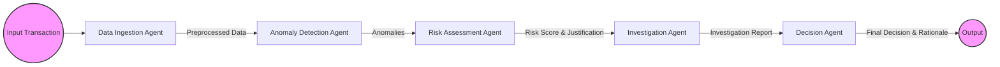

# 🛡️ Guardian Crew - Real-Time Fraud Detection System

An autonomous, LLM-powered multi-agent system designed to detect potentially fraudulent transactions in real-time. It utilizes the [CrewAI](https://www.crewai.com/) framework, [Google Gemini](https://ai.google.dev/) models via API, and features an interactive user interface built with [Streamlit](https://streamlit.io/).

## ✨ Features

- 🤖 **Autonomous AI Agents:** A team of specialized AI agents collaborates to analyze transactions.
- 🧠 **Gemini-Powered Analysis:** Leverages the capabilities of Google Gemini for nuanced understanding and decision-making.
- 🎨 **Interactive UI:** A user-friendly Streamlit interface to input transactions and visualize the detection process.
- 🎬 **Real-Time Simulation:** Observe the agents working step-by-step through the analysis pipeline.
- 📊 **Structured Output:** Provides clear decisions (Approve, Flag, Block) along with a rationale.
- 📝 **Detailed Logging:** Captures the timestamped thoughts and actions of each agent for transparency.

## 🚀 Getting Started

Follow these steps to set up and run the project locally:

1.  **Clone the Repository:**
    ```bash
    git clone <repository-url> # Replace with your repo URL if you fork it
    cd FraudDetection
    ```

2.  **Set up Environment Variables:**
    *   Create a file named `.env` in the project root.
    *   Add your Google Gemini API key to this file. Refer to `.env.example` for the required format:
        ```env
        # .env
        GEMINI_API_KEY=your_google_gemini_api_key_here
        ```
    *   You can obtain a Gemini API key from the [Google AI Studio](https://aistudio.google.com/app/apikey).

3.  **Install Dependencies:**
    *   It's recommended to use a virtual environment (e.g., `venv`, `conda`).
    ```bash
    python -m venv venv
    source venv/bin/activate  # On Windows use `venv\Scripts\activate`
    pip install -r requirements.txt
    ```

4.  **Run the Streamlit App:**
    ```bash
    streamlit run app.py
    ```
    This will open the interactive UI in your web browser.

## 🛠️ System Architecture

The system comprises two main components: the Streamlit frontend and the CrewAI backend.

```mermaid
graph TD
    A[User Input (Streamlit UI)] --> B(app.py);
    B -- Process Transaction --> C(crew.py - FraudDetectionCrew);
    C -- Run Agents & Tasks --> D{CrewAI Framework};
    D -- LLM Calls --> E[Google Gemini API];
    C -- Callback Updates --> B;
    B -- Render UI Updates --> A;
```

### 🤖 Agent Workflow

The `FraudDetectionCrew` orchestrates a sequence of specialized agents:



1.  **Data Ingestion Agent:** Cleans and formats the raw transaction data.
2.  **Anomaly Detection Agent:** Identifies unusual patterns compared to typical transactions.
3.  **Risk Assessment Agent:** Evaluates the identified anomalies and assigns a risk score with justification.
4.  **Investigation Agent:** Performs a deeper dive into high-risk transactions, looking for specific fraud indicators.
5.  **Decision Agent:** Makes the final call (Approve, Flag, Block) based on the accumulated evidence and provides a rationale.

## 📁 Project Structure

```
FraudDetection/
│
├── app.py                 # Main Streamlit application file
├── crew.py                # CrewAI setup (Agents, Tasks, Crew)
├── requirements.txt       # Project dependencies
├── .env                   # API keys and environment variables (ignored by git)
├── .env.example           # Example environment file
└── README.md              # This file
```

## 🧪 Example Transactions (Demo)

Use these examples in the Streamlit UI to see the agents in action:

1.  **Likely Fraudulent:**
    ```json
    {
        "amount": 242424.00,
        "location": "New York",
        "description": "iPhone"
    }
    ```

2.  **Likely Legitimate:**
    ```json
    {
        "amount": 45.50,
        "location": "San Francisco",
        "description": "Coffee Shop"
    }
    ```
3.  **Needs Review (Ambiguous):**
    ```json
    {
        "amount": 1331.00,
        "location": "",
        "description": ""
    }
    ```

## 📜 License

This project is licensed under the MIT License - see the [LICENSE](LICENSE) file for details (if one exists). 